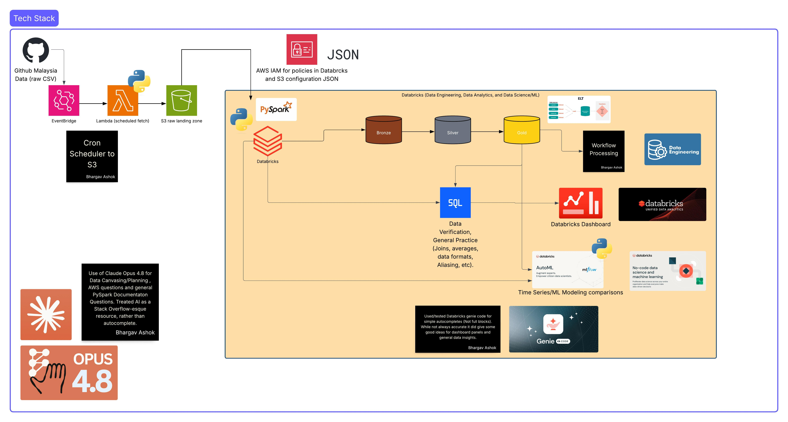
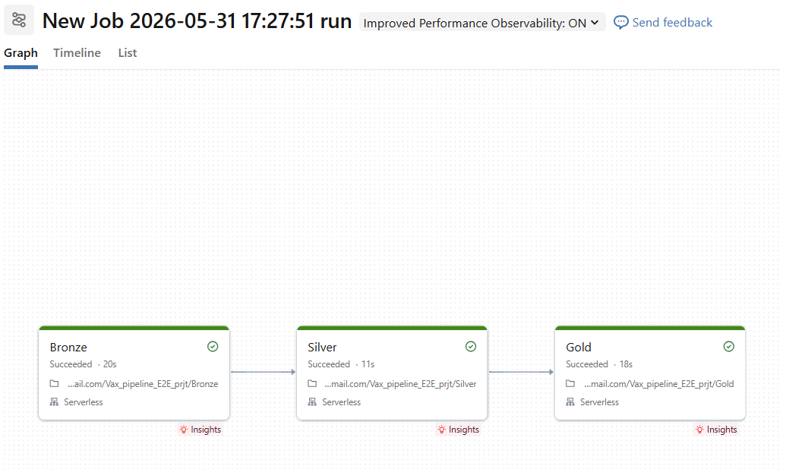

# E2E_Databricks_Data_Project_With_Vaccination_Data

Created an End-to-end Databricks Project using AWS Lambda, S3, and EventBridge triggers, Databricks orchestration workflows, PySpark (medallion architecture), SQL, and Databricks AutoML (Covering Data Engineering, Data Analytics, and Data Science/ML)

## Architecture

**Malaysia Vaccine Data CSV (Git Repo) -> AWS EventBridge -> Lambda config -> IAM → S3 -> Databricks Catalog -> Medallion Architecture -> Bronze -> Silver -> Gold -> Extra Data -> SQL Dashboard + MLflow AutoML model runs Forecast**

## Data sources

Malaysia's COVID-19 vaccination data, published by the **Special Committee for Ensuring Access to COVID-19 Vaccine Supply (CITF)**.

- CITF-Malaysia public data (GitHub): https://github.com/CITF-Malaysia/citf-public
- https://raw.githubusercontent.com/CITF-Malaysia/citf-public/main/vaccination/vax_malaysia.csv

## Screenshots

**Databricks Workspace with Data tables (pyspark tables)**

**Workflow run ELT (bronze → silver → gold)**

**MLflow / AutoML forecasting experiment**

## Resources that helped/aided in project development ##

- https://www.databricks.com/databricks-documentation

- https://spark.apache.org/docs/latest/api/python/user_guide/
  
- Alex the Analyst (SQL and Databricks overview): https://youtu.be/OT1RErkfLNQ?si=AtltqiVrrCHNxIAI, https://youtu.be/jegmI_hSx84?si=g74QBJ0BdNY7veCb, https://www.youtube.com/@AlexTheAnalyst (His Entire Databricks Series is helpful! His Entire Youtube Channel is helpful!)

- More SQL: https://www.thedataschool.co.uk/le-luu/order-of-operations-and-order-of-execution-in-sql/, https://www.datacamp.com/cheat-sheet/sql-basics-cheat-sheet, https://www.sisense.com/blog/sql-query-order-of-operations/

- Luke Bryne | AI Coding (Project Orchestration): https://youtu.be/zIS_ssTQmO0?si=M_6kjVj8T243pqmf, https://www.youtube.com/@ai-luke (Gave me the idea and the "spark" to start this project)

- Codebasics (In-depth Analysis of Databricks, PySpark, and the Underlying Concepts): https://youtu.be/761SQ9Hxbic?si=qMaxoX0Hio9NSJ3J (EXTREMELY helpful video for understanding WHY certain things work in Databricks like Distributed Compute with workers and nodes, Coalesce functions (while not used here, important for production workflows), etc.), https://www.youtube.com/@codebasics

- freeCodeCamp.org (PySpark guidelines): https://youtu.be/_C8kWso4ne4?si=UZceG9zzfveq7RcI Good for understanding PySpark, Data Transformations with filter, map, etc.)

- Thomas Hass (Extra resources for understanding data warehouse concepts and production schema configurations for reliable pipelines): https://youtu.be/gFAnlTM-3Zo, goes over slowly changing dimensions, dlt, change data tracking, etc. Not needed for this smaller project but useful for learning.

- AI usage (Claude Opus 4.8 and Genie Code, used as a coding/planning companion with some simple autocompletes from genie code. More info in the AI log + architetcure diagram notes)

- Personal Databricks Accreditation training (Databricks Academy): https://credentials.databricks.com/8ea7c79a-5f53-417e-ae4d-7f5fcac558fc#acc.Py7W3Qc1, https://credentials.databricks.com/f7e524a8-41f9-4d23-b4a6-0961f2dab3e8#acc.VHsAG98K

## What to improve for next time ##

- Adjust AutoML Train/Test/Split to Prevent Overfitting for some models.

- Create my own ML model with MLFlow (XGBoost, Logistic Regression for checking/predicting daily vaccinations, etc.)

- Pick a larger dataset for more data processing techniques with PySpark (Parquet Coalesce, Batching, etc.)

- Get specific data (By Region, State, etc.) for further Analysis

- Use a sandbox environment for queries, ML (lazyPredict, sci-kit Learn, Imblearn, etc.) before going back into Databricks

- If I were to expand this project into multiple countries/regions that have COVID data in multiple places/formats, I could make use of tools like Dagster/Apache Airflow to organize and orchestrate the data into Databricks with scheduled workflows and conditions (layered architecture explanation article here: https://dagster.io/blog/unlocking-the-full-value-of-your-databricks).

- Using AutoLoader for larger file uploads in a real-world production environment.

Understanding how data flows, from its raw format to using the cleaned and filtered data, for analysis and predictive modeling, is crucial in the current data landscape.
In a production environment, it is important to understand the underlying concepts of workflow orchestration, enterprise data practices, and data parallelism with large compute clusters (i.e. functions for data partitioning, using repartition (increasing the # of partitions for unbalanced data)  or coalese (reducing the number of partitions for reducing output/runtime) and specifically understanding why we do that, how the cores are being used for each worker node, etc.).
This project is supposed to be an introduction to Databricks, and understanding all areas of enterprise data, with big data processing/analytics in PySpark + SQL, and a light introduction to ML modeling with serverless compute (AutoML).

**With that being said, for my first E2E Data project in Databricks, this was a lot of fun! Continuing to learn as I go along :). This is just the beginning. If you have any pointers/feedback, or suggestions, please let me know!**

